[Home - Cloud ERP Extensibility](../../../../#exercises)

# Exercise 1: New App on stack (Developer Extensibility)

## Introduction

In Exercise 1.1 you will build a custom UI on top of the released API **I_BankTP**. This application will allow you to create a bank.  

As an additional (optional) Exercise 1.2 you can try out to consume this released API in a class via EML.   

We will start by showing you how you can search for a released RAP business object. For this we will use the *Released Objects* part of the *Project Explorer* in ADT.

> **Reminder:**   
> Don't forget to replace all occurences of the placeholder **`###`** with your group ID in the exercise steps below.  
> You can use the ADT function **Replace All** (**Ctrl+F**) for the purpose.   
> When you don't know your group number anymore you can check the transport that has been created when you repository objects have been generated. 
> Here you can check for example the name of the generated package.
>
> 

## Exercise 1.1: Generate a UI on top of a released Business Object Interface

In Exercise 1.1 you will build a custom UI on top of the released API **I_BankTP**. 

  
Click to expand!

  1. In the Project Explorer select the **Released Objects** tree and then the node **USE_IN_CLOUD_DEVELOPMENT**. Here you have to open the folder **Core Data Services** and then the folder **Behavior Definitions** where you find the C1-released Business Object Interface `I_BankTP`.

      

  2. Right-click on the interface  `I_BankTP` and select **Generate ABAP Repository Objects**  

      

  3. Select **OData UI Service** and then **Next**   

        

  4. Select the package `ZRAP630_###_EXT` where `###` is the unique ID chosen by the generator class by pressing the **Browse** button and press **Next**.

      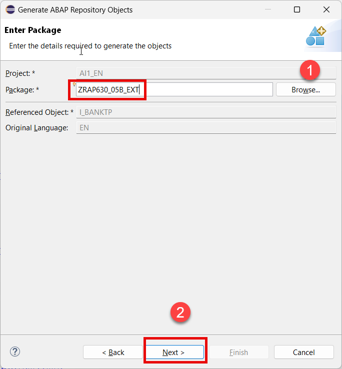  

  5. The generator finishes with the *Configure Generator* screen. 

     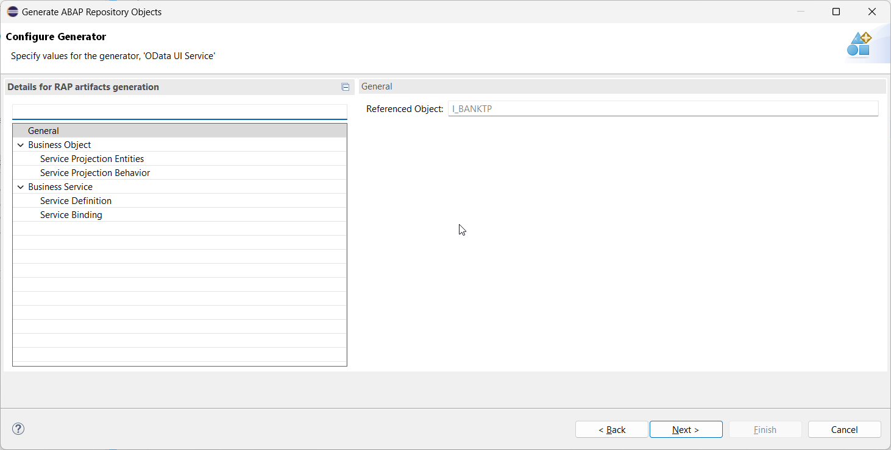 
      
     When you want to change the names of the repository objects that will be generated you can do so by selecting the entries **Service Projection Entities**, **Service Projection Behavior**, **Service Definition** and **Service Binding**.   

     Though the generator will suggest unique names you should change the suggested names by adding your group number `###` so that it is easier to identify in a workshop the owner of a generated object.
          
  
  6. When selecting **Service Projection Entities** you can change the suggested name of the CDS projection view(s). For this click on **Edit**, change the CDS Entity Name by adding your group number `###` and press **OK**.

     > !!! Please note that you cannot change the name of the metadata extension.   
     > !!! The name is not automatically be refreshed.   
     > !!! The updated name will be shown at a later stage when all objects that are   
     > !!! going to be generated will be shown.   
     
      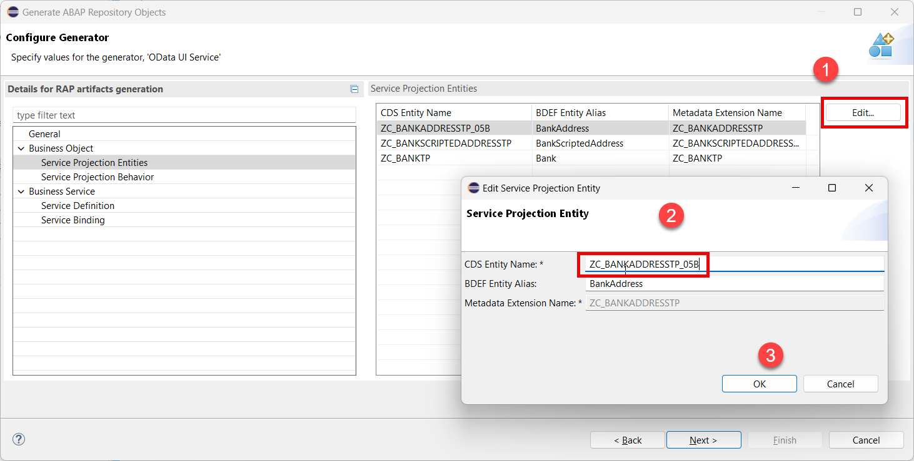  

  7. When selecting **Service Projection Behavior** you can change the suggested name of the **Behavior Implementation Class**. In addition you can decide whether your UI shall support draft as well when the underlying RAP business object provides draft, by checking **with draft**. Press **Next**.    

      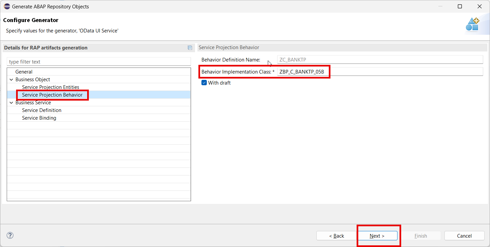  

  8. When selecting **Service Definition** you can change the suggested name of the **Service Definition Name**.  

      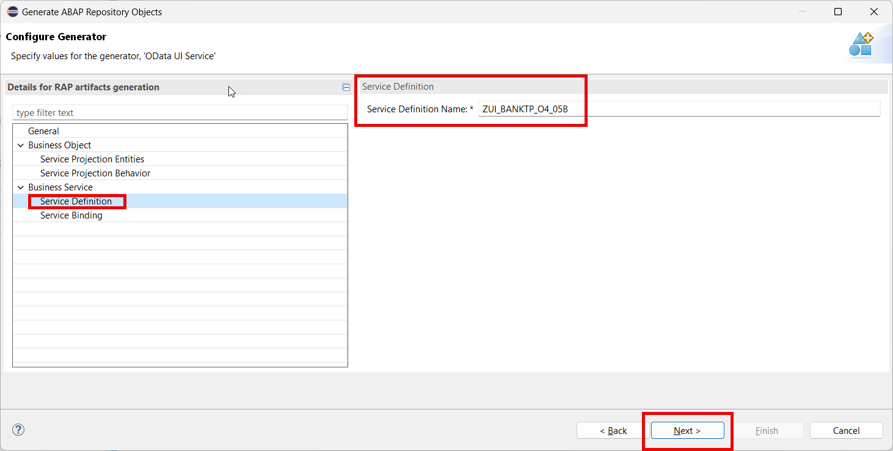  

  9. When selecting **Service Binding** you can change the suggested name of the **Service Binding Name**. By pressing **Next** you can start the generation process.  
                                      
         

  10. The wizard shows an overview of the repository objects that are going to be generated. Press **Next**.   

        

  11. Select the transport that has been created for the package `ZRAP630_###_EXT` or create a new transport and press **Finish** to start the generation of the repository objects.   

        
    

### Publish service and test the application 

1. When the generation process is finished a new tab with the generated Service Binding will be opened in ADT. Click **Publish** to publish the service binding locally. In the project explorer you can see all objects that have been generated.    

      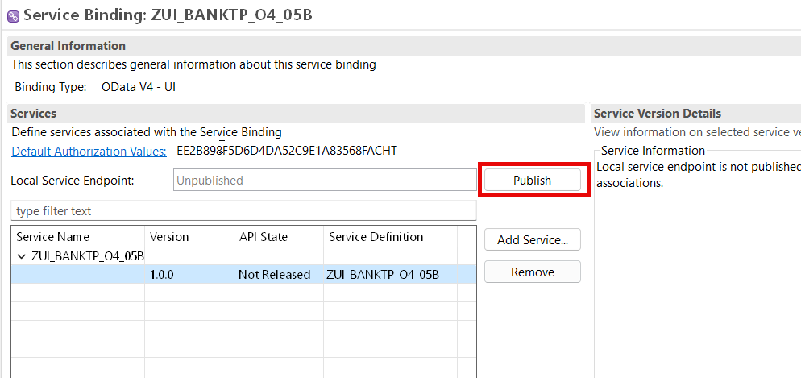

      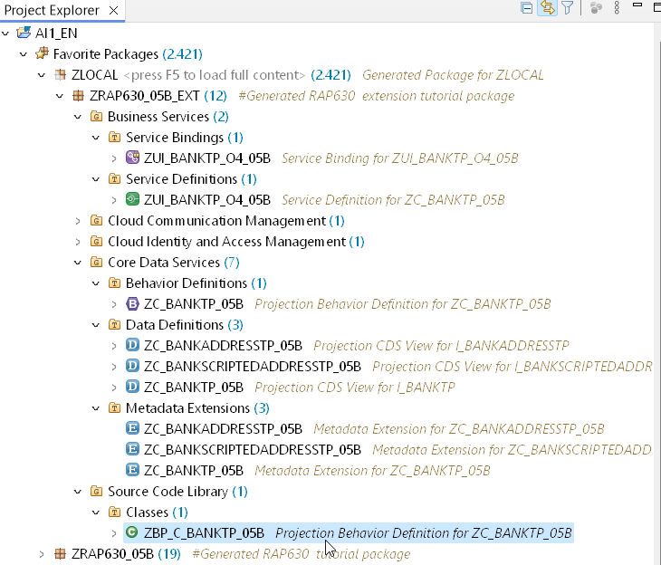

2. Select the entity set `Bank` and click **Preview** or double-click on the entity set `Bank`. This will start the SAP Fiori Elements preview.  

      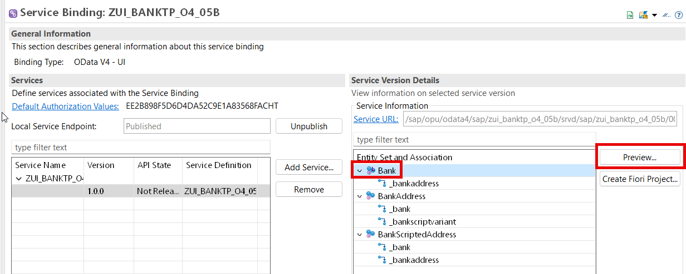

3. In the preview of your app press the button **Create** to create a new bank.

      

4. Enter values in the fields **Bank Country / Region** e.g. `CZ` and **Bank Key** e.g. `1234` and press **Continue**.

      

5. The object page opens and you have to provide data for the remaining mandatory fields such as the **Bank Name**.  

      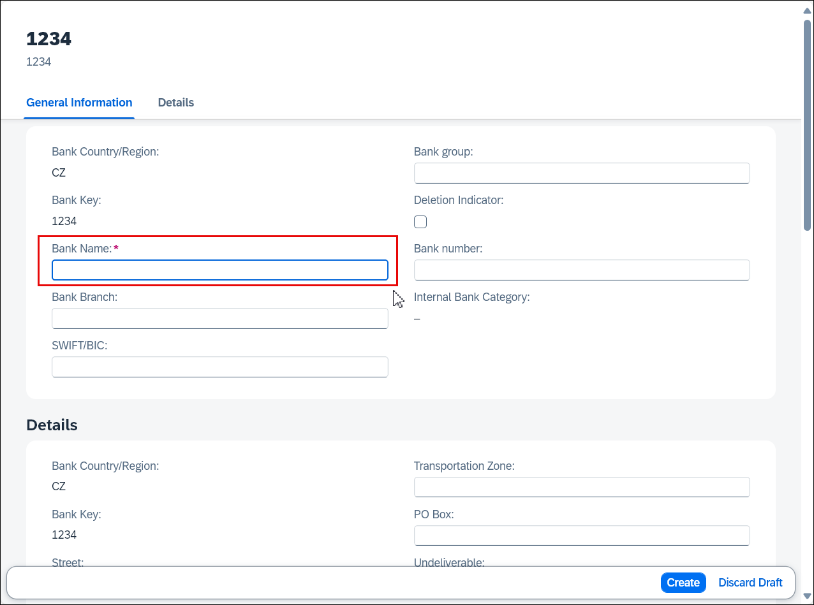  

### Troubleshooting

1. When your development user does not have the authorization to create new banks you will receive the following error message: **You are not authorized to create bank data for country/region CZ.**   

          

2. In order to identify the missing authorizations you can check the **Knowledge Transfer Document** of `I_BANKTP`. Either open it using the shortcut **Ctrl+Shift+A** or navigate to it in the Project Explorer as shown as shown below.  

      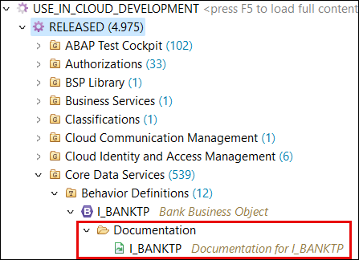

3. As you can see the business object `I_BankTP` checks for the authorization objects `F_BNKA_MAO` and `F_BNKA_INT`.  

      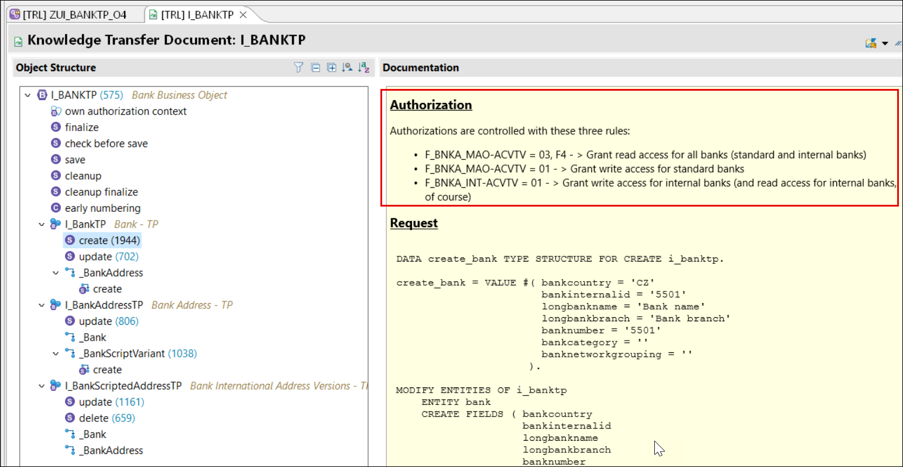

> ⚠️  
> The issue can only be resolved by creating an appropriate IAM app, assigning the same to a business catalog which in the end has to be assigned to a new or existing role that has to be assigned to your user.  
> In the next (optional) exercise where the BO is called as an API we show a workaround how the API can be called in a so called priveliged mode.  

## Exercise 1.2: Use a released RAP BO in a custom application (optional)
[^Top of page](#)

A second typical use case where released API's in an SAP S/4HANA system are used for, is using such an API in your own code that might for example be consumed as part of an application job. 

  
This is an optional exercise.

> Create a class  in the extension package `ZRAP630_###_EXT` to test the effects of using the language version *ABAP for Cloud Development*.   

 

  
Click to expand!

  1. Right-click on your ABAP package **`ZRAP630_###_EXT`** and select **New** > **ABAP Class** from the context menu.

      . 
  
  2. Maintain the required information (`###` is your group ID).
      - Name: **`zcl_test_abap_cloud_###`**
      - Description: _**`Test ABAP Cloud Governance`**_                  

      Click on **Add** and select the interface `if_oo_adt_classrun` and press OK. 

      and click **Next >**

      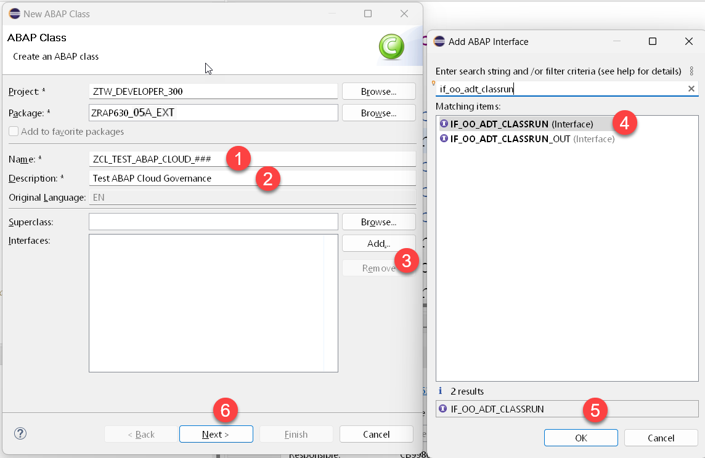. 

  3. Select or create a transport request, and click **Finish** to create the class.

  4. Replace the code in the method  `if_oo_adt_classrun~main( )` with the following code snippet.
     
     > Tip
     > You have to replace the value for **'####'** with a string that only contains numbers.   

     > Coding explained:  
     > The coding leverages the `response` parameter of EML statements that is used to specify response parameters for ABAP EML statements
     > to get information on the following:  
     > - Failures, i. e. operations that could not get processed (FAILED failed_resp)   
     > - Key mapping information (MAPPED mapped_resp)   
     > - Returned error messages (REPORTED reported_resp)   
  
     <pre lang="ABAP">  
     METHOD if_oo_adt_classrun~main.
     
      DATA create_bank TYPE STRUCTURE FOR CREATE i_banktp.
      DATA bank_id_number TYPE i_banktp-BankInternalID VALUE '8###'.

      create_bank = VALUE #( bankcountry = 'CZ'
                           bankinternalid = bank_id_number
                           longbankname = 'Bank name'
                           longbankbranch = 'Bank branch'
                           banknumber = bank_id_number
                           bankcategory = ''
                           banknetworkgrouping = ''
                           swiftcode = 'SABMGB2LACP'
                           ismarkedfordeletion = ''
                    ).

      MODIFY ENTITIES OF i_banktp
      ENTITY bank
      CREATE FIELDS ( bankcountry
                    bankinternalid
                    longbankname
                    longbankbranch
                    banknumber
                    bankcategory
                    banknetworkgrouping
                    swiftcode
                    IsMarkedForDeletion
                 )
       WITH VALUE #( (
       %cid = 'cid1'
         bankcountry         = create_bank-bankcountry
         bankinternalid      = create_bank-bankinternalid
         longbankname        = create_bank-longbankname
         longbankbranch      = create_bank-longbankbranch
         banknumber          = create_bank-banknumber
         bankcategory        = create_bank-bankcategory
         banknetworkgrouping = create_bank-banknetworkgrouping
         SWIFTCode           = create_bank-SWIFTCode
         IsMarkedForDeletion = create_bank-IsMarkedForDeletion
         )  )

       MAPPED DATA(mapped)
       REPORTED DATA(reported)
       FAILED DATA(failed).

      LOOP AT reported-bank INTO DATA(reported_error_1).
      DATA(exc_create_bank) = cl_message_helper=>get_longtext_for_message(
        EXPORTING
          text               = reported_error_1-%msg
        ).
        out->write( |error { exc_create_bank } |  ).
      ENDLOOP.

      COMMIT ENTITIES
      RESPONSE OF i_banktp
      FAILED DATA(failed_commit)
      REPORTED DATA(reported_commit).

      LOOP AT reported_commit-bank INTO DATA(reported_error_2).
      DATA(exc_create_bank2) = cl_message_helper=>get_longtext_for_message(
        EXPORTING
          text               = reported_error_2-%msg
      ).
      out->write( |error { exc_create_bank2 } |  ).
      ENDLOOP.
      IF reported_commit-bank IS INITIAL.
      COMMIT WORK.

      SELECT SINGLE * FROM I_Bank_2 WHERE BankInternalID = @bank_id_number INTO @DATA(my_bank).
      out->write( |my new bank { my_bank-BankName } { my_bank-BankInternalID }| ).
      ENDIF.
     ENDMETHOD.
     </pre>   

  5. Activate your changes by pressing **Ctrl+F3**

  6. Run the test class by pressing **F9**.  

     You will notice that an error message is thrown. Namely `error You are not authorized to create bank data for country/region CZ.` 
     Consequently also no new data is found. 

           
     
  7. Adding **PRIVILEGED** to the EML call

     When we add the key word `PRIVILEGED` to our EML call the authorization checks for the authorization objects
     `F_BNKA_MAO` and `F_BNKA_INT` will basically be skipped.

     <pre lang="ABAP">
     MODIFY ENTITIES OF i_banktp
     PRIVILEGED
     ENTITY bank
     CREATE FIELDS ( bankcountry
                    bankinternalid
                    longbankname
                    ...
     </pre>    
     
     When you now run the class again using F9 you will find that the creation of a new bank seem to have worked.

     However the select statement is not able to retrieve the newly created data.

     

        
Click to learn more about the PRIVILEGED EML access

     

       We will now check the behavior definition of the Bank RAP business object. To do so use Ctrl+Shift+A to open the behavior definition `R_BankTP`.
     
       In the source code (see below) we see that the BDEF `R_BankTP` defines two so called authorization contexts:

         - _Own authorization context_ : Lists all authorization objects used by the RAP BO implementation.
         - _NoCheckWhenPrivileged_ : Lists authorization objects that can be skipped by a RAP BO consumer with privileged access.

       
     
     
  
     
  8. Adding **WITH PRIVILEGED ACCESS** to the ABAP SQL statement
  
     Similar to enforce skipping the authorization checks when creating a new bank it is also possible to enforce skipping of the authorization check that is imposed by the underlying DCL which performs a check on the authorization object `F_BNKA_MAO` and the field `BBANKS` for displaying data.  
     
     Open the DCL  and check its source code.        
     
     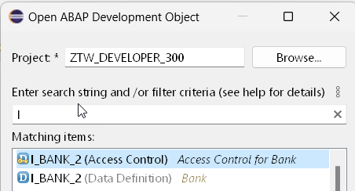   
     
        
     
     When we now change the ABAP SQL statement such that we add the key words ` WITH PRIVILEGED ACCESS` to it:   
     
     <pre lang="ABAP">
       SELECT SINGLE * FROM I_Bank_2
       WITH PRIVILEGED ACCESS
       WHERE BankInternalID = @bank_id_number INTO @DATA(my_bank).
     </pre>
     
     we see that the data is now successfully been created and can also be read.  
     
  
        
     
  
   9. Other potential problems
  
      The I_BankTP RAP BO checks whether the provided switft code fits to the ISO code of the region. 
  
       - error ISO code GB in the SWIFT code SABMGB2LACP is not correct for country/region US. Diagnosis Positions 5 and 6 of the SWIFT code do not correspond to the ISO code of country/region US. Procedure Check your entries. If necessary, check whether the ISO code of country/region US has been defined correctly.  
       
      When a bank with the ID that is provided already exists you will receive an error message as well.

       - error Bank CZ 8888 already exists.
  
 
  
 
 <!--- 
  
 ## Exercise 1.2: Examine the documentation of the released RAP BO I_BankTP
 
[^Top of page](#)

The documentation for a released RAP business object can be found in so called **Knowledge Transfer Documents** which have the same name as the business object (released API) it describes.     

 

  
Click to expand!

  1. You can find the **Knowledge Transfer Document** of a realeased API in the folder **Documentation** underneath the business object in the Project Explorer.
  
     It can also be opened from within the source code editor of your behavior definition. Here you find the link at the top of the source code of the behavior definition.

      

  2. The **Knowledge Transfer Document** can also be opened directly via the **Open Development Object** dialogu that can be opened via the menu or via the short cut **Ctrl+Shift+A**.  

      

  3. When you have opened the **Knowledge Transfer Document** you should change from the **Source** tab to the more appealing visualization of the **Output** tab.  

       

  4. The **Knowledge Transfer Document** provides you with code snippets that help you to write code to perform the operation (e.g. *create* as shown below) or an action which is supported by this business object.  

          

These code templates have been used to create the test class that calls the API **I_BankTP** in order to create purchase requisitions in the last excercise.

 

## Exercise 1.3: Find the released RAP BO I_BankTP as a successor of table BNKA
[^Top of page](#)

  
Click to expand!

1. Open the test class **`zcl_test_abap_cloud_###`** that you have created in **Exercise 1.1.**.

2. Copy the code snippet provided below and add it add the and in the implementation section of the methode `main`. 
 
   > **Hint**: Hover the code snippet and choose the _Copy raw contents_ icon  appearing in the upper-right corner to copy it. 
   
   <pre lang="ABAP">
    
    "... the code with the EML statement

    DATA bank_address  TYPE bapi1011_address.
    DATA bank_ctry  TYPE banks  .

    CALL FUNCTION 'BAPI_BANK_CREATE'
      EXPORTING
        bank_ctry    = bank_ctry
        bank_address = bank_address
    "  IMPORTING
    "       return       =
    "       bankcountry  =
    "       bankkey      =
      .

    SELECT * FROM bnka WHERE bankl = '0010001516' INTO TABLE @DATA(my_banks).
  
   </pre>

   Since your class **`zcl_test_abap_cloud_###`** uses the ABAP Cloud development model (ABAP language version “ABAP for Cloud development”) the source code now 
   cannot be compiled anymore because of several ABAP statements containing syntax-errors:

    - Line 103: The use of Table **BAPI1011_ADDRESS** is not permitted.	
    - Line 104: The use of Data Element **BANKS** is not permitted.	
    - Line 106: The use of Function Module **BAPI_BANK_CREATE** is not permitted, but for this function module a successor is available, namely the Behavior   Definition **`I_BANKTP`**. 	
    - Line 116: The use of Table **BNKA** is not permitted. Use CDS Entity **I_BANK_2** instead.
             
    .
  
      
3. The effect of the release state **Not to Be Released** in combination with a successor is illustrated below for the table `BNKA`, which was replaced by the CDS view `I_BANK_2`. When you open an object such as `BNKA` for which a success is maintained you see this information also in the **Properties** in ADT where you have the option to conveniently navigate to the successor object.   
   
    . 

 
4. In order to activate your class again you would have to comment out or remove the forbidden statements. 
 

--->

 
 

## Summary 
[^Top of page](#)

Now that you've have learned about how to leverage the released API **I_BankTP** in *ABAP Cloud* you can continue with the next exercise where you will learn how to extend an extensible RAP business object- **[Exercise 2](../ex2/#readme)**.

## Further Reading
[^Top of page](#)

  
Click to expand!

### No Information in your system ? --> Find information about Released API's in GitHub

While developing an ABAP Application for _S/4HANA on premise_ or _S/4HANA private cloud edition_ , you do get the following error message: "Use of <Object Type> <Object Name> is not permitted". 
 
But the error message does not provide a hint which API or object to use instead. The reason is that the successor information in on premise system does not contain the latest updates such as in SAP S/4HANA Cloud, ABAP Environment system or SAP BTP, ABAP Environment.   

An example would be the table `BNK2`.  

 You as a developer nevertheless want to find out which objects to use intstead and to check their documentation.   
 
  1. Check out the GitHub repository. 
  
     The repository contains the list of released APIs of S/4HANA Cloud. In addition also the objects that are not released are contained with the specification of successor objects. All objects are contained in one JSON file. This file is used as content for the ABAP Test Cockpit Check "Usage of Released APIs (Cloudification Repository)". This check can be used by customers and partners to analyse existing custom code concerning the usage of released and not released APIs on all ECC and S/4HANA releases. The check is available in SAP BTP, ABAP environment.
     
     [S/4 HANA Cloud - Released objects for ATC Check (Cloudification Repository)](https://github.com/SAP/abap-atc-cr-cv-s4hc).
     
     When we check the **csv file** that is public available we can retrieve a list of successors for the table BNKA.  
 
       
   
     While csv files are nice for human beings, computers prefer json files.  
 
     [Link to json sample file](https://raw.githubusercontent.com/SAP/abap-atc-cr-cv-s4hc/main/src/objectReleaseInfo_2208.json) 

 You can continue with the next exercise - **[Exercise 2.1](../ex2/#readme)**.
  
 
  

