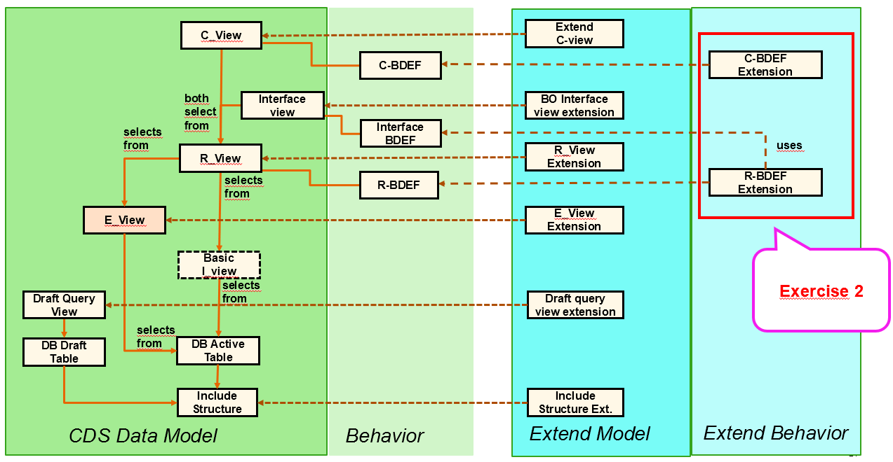
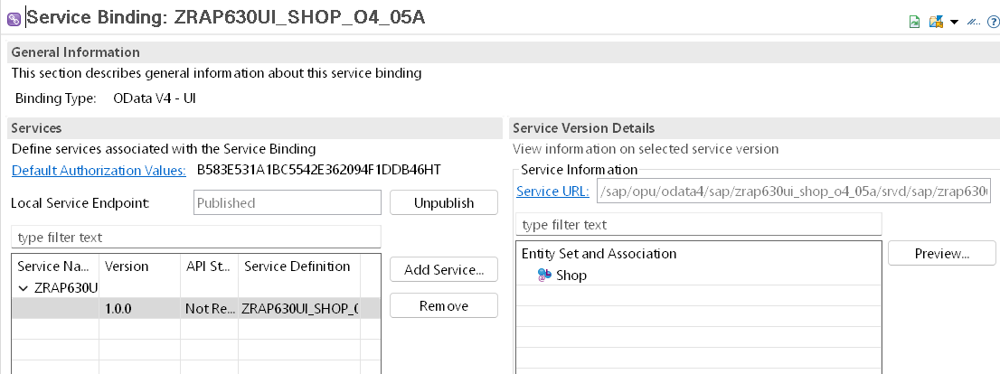
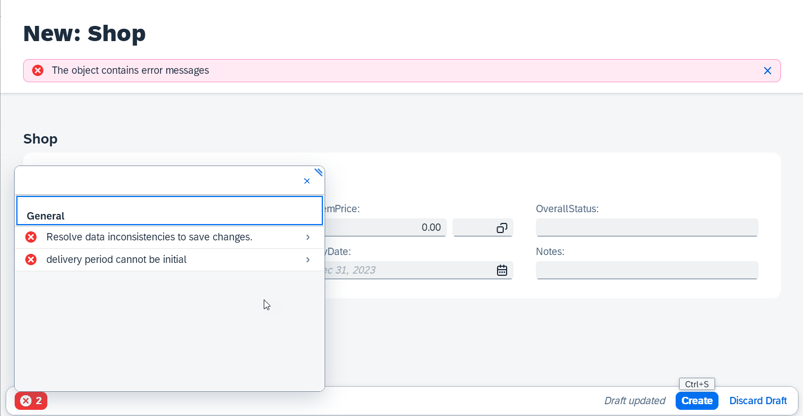

[Home - Cloud ERP Extensibility](../../../../#exercises)

# Excercise 2 - Extend a RAP business object

## Exercise 2.1 - Behavior extension

In this exercise, we will extend the behavior of an extensible RAP BO. That means we will add a validation, a determination and side-effects to the behavior of the RAP BO by using an extenstion.   

Since extending a RAP BO in parallel by several developers can cause severe problems every participant will work with his or her own base RAP BO. For your convenience an extensible RAP BO has thus been generated using the class `zdmo_gen_rap630_single` that you have run in the [Getting started](../ex0/README.md) section.  

### Exercise 2.1.1 Extend the behavior definition with a validation

>  After completing these steps you will have created a validation to check the delivery date.  

 

  
🔵 Click to expand!

1. Right-click on the behavior definition `ZRAP630R_ShopTP_###` and select **New Behavior Extension** from the context menue. 

      

2. In the Create Behavior Extension dialogue enter the following values

    > **⚠⚠⚠ Caution**     
    > Be sure to change the name of the package from `ZRAP630_###` to `ZRAP630_###_EXT`.
    > By default the dialogue will propose the package name of the base RAP BO.  
    > In case of a package delivered by SAP this won't be a problem, but here we want to build the extension in a different package
    > in the customer namespace `Z`.
    
    **Package**: ⚠`ZRAP630_###_EXT`⚠   
    **Name**: `ZRAP630R_EXT_SHOPTP_###`  
    **Description**: `Extension for ZRAP630R_ShopTP_###`    
    **Behavior Definition**: `ZRAP630R_SHOPTP_###`  
    **BO Interface**: `ZRAP630I_SHOPTP_###`  

       

3. Select a transport request and press **Finish**   <  

4. Add a validation `zz_validateDeliverydate` to your behavior defintion that reacts on `create;` and the field `DeliveryDate;`  
   This validation must also be added to the `draft determine action Prepare` and activate your changes.
 
   <pre lang="ABAP">
   extension using interface zrap630i_shoptp_###
   implementation in class zbp_rap630r_ext_shoptp_### unique;

   extend behavior for Shop
   {     
     validation zz_validateDeliverydate on save { create;   field DeliveryDate; }

     extend draft determine action  Prepare
     {
       validation zz_validateDeliveryDate;
     }
   }  
   </pre> 

   
5. Click on the proposed name of the behavior implementation class **(1)** of your behavior extension and press **Ctrl+1** to start the content assist and click on the proposed action **(2)** and press Next **(3)**.  
   
    
   
6. Select a transport request and press **Finish**.    
   
7. This will open the editor for your behavior implementation class. Here you have to have to navigate to the **Local Types** tab since the implementation of behaviors takes place in local classes.    

       

8. Add the following code to the local class `lhc_shop` which implements the validation. 

   <pre lang="ABAP">   
   CLASS lhc_shop DEFINITION INHERITING FROM cl_abap_behavior_handler.   
   
     PUBLIC SECTION.  
       CONSTANTS state_area_check_delivery_date       TYPE string VALUE 'CHECK_DELIVERYDATE'       ##NO_TEXT.   
     PRIVATE SECTION.  
       METHODS zz_validateDeliverydate               FOR VALIDATE ON SAVE  
         IMPORTING keys FOR Shop~zz_validateDeliverydate.  
   
   ENDCLASS.  
   
   CLASS lhc_shop IMPLEMENTATION.  
   
     METHOD zz_validateDeliverydate.  
       READ ENTITIES OF ZRAP630i_ShopTP_### IN LOCAL MODE  
               ENTITY Shop  
               FIELDS ( DeliveryDate OverallStatus )  
               WITH CORRESPONDING #( keys )  
               RESULT DATA(onlineorders).  
   
       LOOP AT onlineorders INTO DATA(onlineorder).  
         APPEND VALUE #( %tky           = onlineorder-%tky  
                         %state_area    = state_area_check_delivery_date )  
                TO reported-shop.  
         DATA(deliverydate)             =  onlineorder-DeliveryDate - cl_abap_context_info=>get_system_date(  ).  
         IF onlineorder-deliverydate IS INITIAL  .  
           APPEND VALUE #( %tky           = onlineorder-%tky ) TO failed-shop.  
           APPEND VALUE #( %tky           = onlineorder-%tky  
                           %state_area    = state_area_check_delivery_date  
                           %msg           = new_message_with_text(  
                                               severity = if_abap_behv_message=>severity-error  
                                               text     = 'delivery period cannot be initial'  
                          ) )  
                   TO reported-shop.  
         ENDIF.  
       ENDLOOP.  
     ENDMETHOD.  
   ENDCLASS.  
   </pre>  

9. Open the service binding `ZRAP630UI_SHOP_O4_###` of your RAP base BO.

10. Double-click on the entity **Shop** . This will start the ADT preview of the Shop RAP BO.  

     

10. Press the **Create** button on the list page.
11. The **New : Shop** object page opens where you have to enter the data for a new order.      
12. Select a product for the field **OrderedItem** but do **NOT** select a **Delivery Date**
13. Press Create.   
14. This shall raise the follwoing error message:   

       

### Exercise 2.1.2 Extend the behavior definition with an determination

In a second step we will now add a determination `ZZ_setOverallStatus` to the behavior defintion extension. This shall be executed in case the content of the field `OrderedItem` is changed by the user.   

 

  
🔵 Click to expand!

 
1. Add the following statement to your behavior defintion extension `ZRAP630R_EXT_SHOPTP_###`.     

   <pre lang="ABAP">
     determination ZZ_setOverallStatus on modify {  field OrderedItem; }
   </pre>
  
   so that the code of your BDEF should now read as follows:   
   <pre lang="ABAP">   
   extension using interface zrap630i_shoptp_###
     implementation in class zbp_rap630r_ext_shoptp_### unique;
 
   extend behavior for Shop
   {
     validation zz_validateDeliverydate on save { create; field DeliveryDate; }
 
     extend draft determine action Prepare
      {
        validation zz_validateDeliveryDate;
       }
     determination ZZ_setOverallStatus on modify { field OrderedItem; }
    }
   </pre>

2. Press **Ctrl+1** to start the content assist and double-click on the proposal to add the appropriate code in the behavior implementation class `zbp_rap630r_ext_shoptp_###`. 

3. Add the following code into the implementation of the method `ZZ_setOverallStatus`.
   
   > The code first performs a read request using EML using the key fields of our RAP BO that are provided by the framework an reads the data of all affected 
   > orders. In the following loop statement it is checked whether the price exceeds a certain threshould (1000 EUR) and depending on the price the order is 
   > either autmatically approved or is awaiting an approval.   
   > The price for a product is read from an CDS view and the instance of the RAP BO is modified accordingly.    
 
   <pre lang="ABAP">
   METHOD ZZ_setOverallStatus.

    DATA update_bo      TYPE TABLE FOR UPDATE     ZRAP630i_ShopTP_###\\Shop.
    DATA update_bo_line TYPE STRUCTURE FOR UPDATE ZRAP630i_ShopTP_###\\Shop .

    READ ENTITIES OF ZRAP630I_ShopTP_### IN LOCAL MODE
      ENTITY Shop
        ALL FIELDS " ( OrderItemPrice OrderID )
        WITH CORRESPONDING #( keys )
      RESULT DATA(OnlineOrders)
      FAILED DATA(onlineorders_failed)
      REPORTED DATA(onlineorders_reported).

    DATA(product_value_help) = NEW zrap630_cl_vh_product_###(  ).
    data(products) = product_value_help->get_products(  ).

    LOOP AT onlineorders INTO DATA(onlineorder).

      update_bo_line-%tky = onlineorder-%tky.

      SELECT SINGLE * FROM @products as hugo
         WHERE Product = @onlineorder-OrderedItem  INTO @data(product).

      update_bo_line-OrderItemPrice = product-Price.
      update_bo_line-CurrencyCode = product-Currency.

      IF product-Price > 1000.
        update_bo_line-OverallStatus = 'Awaiting approval'.
      ELSE.
        update_bo_line-OverallStatus = 'Automatically approved'.
      ENDIF.
    
      APPEND update_bo_line TO update_bo.
    ENDLOOP.

    MODIFY ENTITIES OF zrap630i_shoptp_### IN LOCAL MODE
      ENTITY Shop
        UPDATE FIELDS (
        OverallStatus
        CurrencyCode
        OrderItemPrice
        )
        WITH update_bo
       REPORTED DATA(update_reported).

    reported = CORRESPONDING #( DEEP update_reported ).

    ENDMETHOD.
   
   </pre>

3. > When you get the error message:   
   > The entity "SHOP" does not have a determination "ZZ_SETOVERALLSTATUS".	 
   > This might be, because you have not activated yor BDEF yet.   

4. Create a new entity and select an item or change the item an existing entity,  
   **but don't save your changes** so that only the draft is affected.   

   > You will notice that the draft data for the item name is updated, but the price is NOT updated in the draft.
   > Also the approval status does not change in the draft if the product price becomes larger than 1000 Euro.  
   > The data will only be updated in the UI once you save your data.  
   > This we will change in the following step of our excerise by using side effects.

### Exercise 2.1.3 Extend the behavior definition with side effects

Now you can continue and add side effects via your behavior defintion extension.

> Please note:  
> An extension via side effects is only possible if the extensible RAP business objects provide the `use side effects` statement in its behavior projection or in its interface projection. 
> Since the statement `use side effects` can not be added via an extension itself this has thus to be foreseen by the developer.  

  
🔵 Click to expand!

1. Open the behavior extension `ZRAP630R_Ext_ShopTP_###` by pressing **Ctrl+Shift+A**.
2. Add the following code snippet  
   
   <pre lang="ABAP">side effects { field OrderedItem affects field OrderItemPrice , field CurrencyCode ; }</pre>  

   to your behavior extension right after the determination. 
 
   Your BDEF extension code should now read as follows:  

   <pre lang="ABAP">
     extension using interface zrap630i_shoptp_###
       implementation in class zbp_rap630r_ext_shoptp_### unique;
 
       extend behavior for Shop
    {
      validation zz_validateDeliverydate on save { create; field DeliveryDate; }
      extend draft determine action Prepare
      {
        validation zz_validateDeliveryDate;
       }
     determination ZZ_setOverallStatus on modify { field OrderedItem; }
     side effects { field OrderedItem affects field OrderItemPrice , field CurrencyCode , field OverallStatus ; }
     }
    </pre>

3. Create a new order, specify a delivery data or open an existing order and switch to the edit mode and then select a (new) product. 
   
   You will notice that the data for the product that you have selected in the SAP Fiori UI is being updated automatically.  
   Also the approval status changes if the price changes from below 1000 Euro to a value that is larger than 1000 Euro and vice versa.    
   
   
 
 
</pre> 
 

## Summary

You've now extended the behavior of the base RAP business object. For this you only had to create an extension of the BDEF of the base BO on the R-layer.

Continue to - [Exercise 3 - Extend the data model ](../ex3/README.md)

