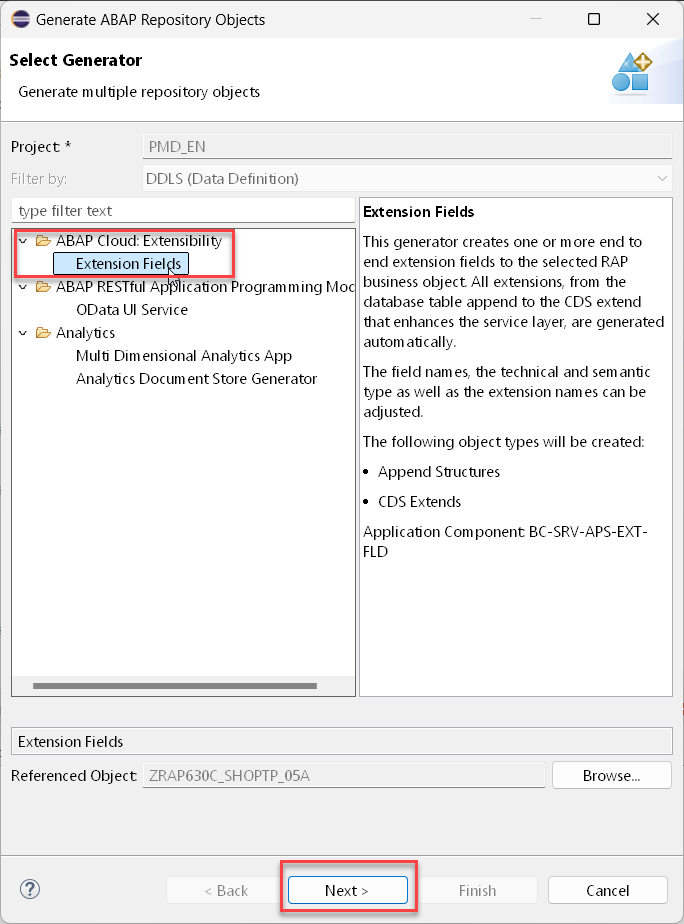
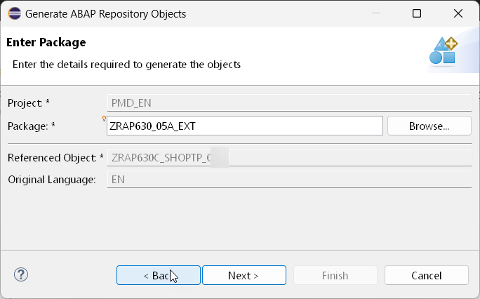
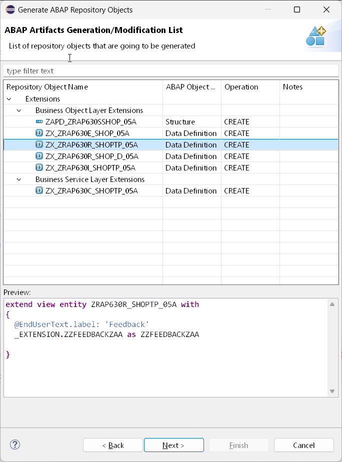
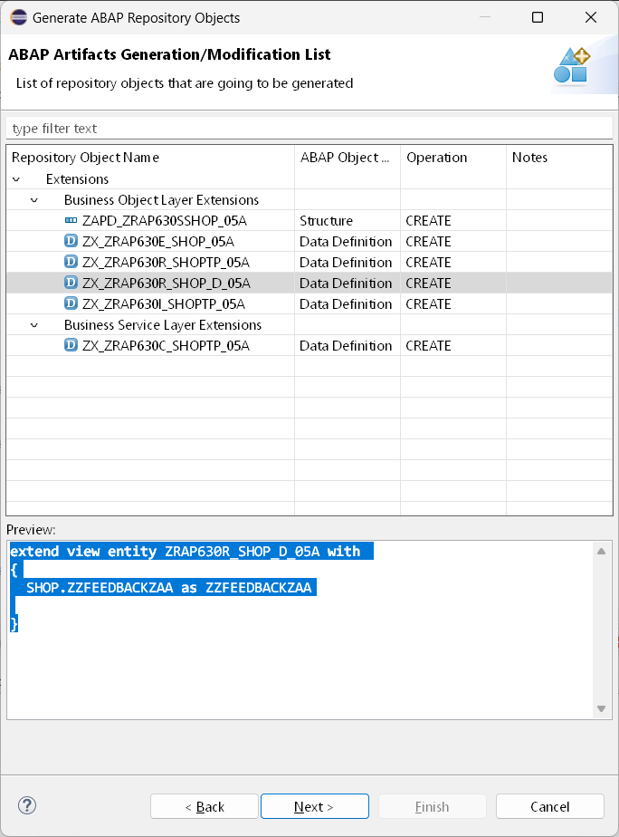
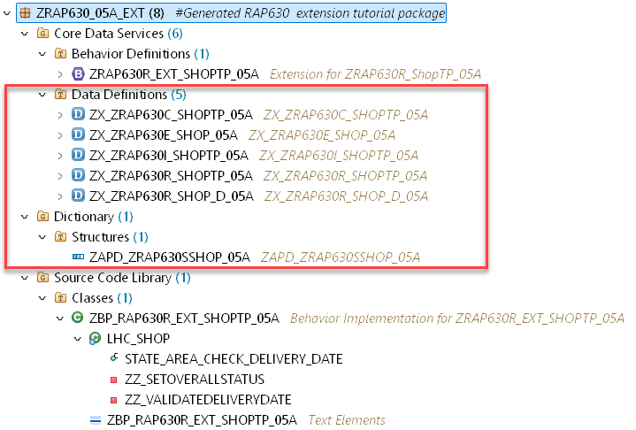

[Home - Cloud ERP Extensibility](../../../../#exercises)  

# Exercise 3 - Extend the CDS data model using the field extension wizard 

In the preceeding exercise we have extended the _behavior_ of the based RAP BO by adding a determination, a validation and a side effect. 

We will now adapt the _CDS data model_, that means we will add new fields to the _Shop_ entity. 

Compared to the activities for adding additional behavior this is a larger amount of work since the complete stack of CDS views has be extended rather than only extensing the behavior definition (BDEF).

Fortunately there is now for the ABAP Environments in SAP BTP and SAP S/4HANA an [extension field wizard](https://help.sap.com/docs/abap-cloud/abap-development-tools-user-guide/generating-extension-fields) available which can be used to add extension fields to existing RAP business objects.


## Exercise 3.1 - Check (and adapt) the CDS data model (of the extensible base RAP BO)

In order to extend the data model of a RAP BO the base RAP BO must be enabled to support extensibility as described in the Online Help.  
[RAP Extensibility-Enablement](https://help.sap.com/docs/abap-cloud/abap-rap/rap-extensibility-enablement)

For your convenience we have generated such an extensible RAP BO `ZRAP630R_ShopTP_###` for you.

The **extension field wizard** can be started from the consumption (c-view) or interface projection view (i-view) or from the underlying restricted base view (r-view). Depending on which view is used as the starting point certain options are pre-set in the wizard. 

   

When for example using the C-view as the entry point the wizard will suggest to extend the C-view by default.


## Excercise 3.2 - Extend the data structure with the extension field wizard

1. Right click on the consumption projection view `ZRAP630C_ShopTP_###` (the one with the statement `provider contract TRANSACTIONAL_QUERY` ) and choose **Generate ABAP Repository Objects ..**.

    

3. In the **Select Generator** screen choose **ABAP Cloud: Extensibility** and then **Extension Fields**. Press **Next**.

      
  
4. In the **Enter Package** screen enter the name of the package `ZRAP630_###_EXT` and press **Next**.

    

5. In the **Configure Generator** screen press **Add** (1). Then, in the **Add Field** dialogue enter the following values (2) to add a field to enter feedback:   

   - Name `ZZFEEDBACKZAA`  
   - Label: `Feedback`  
   - Data Elemeent: `TEXT100`  
   - Activate the check box **Generate UI annotations**   (3)
  
   and press **Add** (4)

     
 
6. Expand the section **Business Service Layer Extensions** and verify that the option **Extend Object ?** is checked and press **Next**.   

     
  
7. The wizard now shows the list of ABAP Artifacts that are going to be created / modified.

   

   You can check out the code for also for the other artifacts that are going to be generated

   <details>
     <summary>🔵 Click to show other artifacts</summary>

     ### Extension include structure 
 
     

     ### Extension include view
 
     


     ### Extension for draft query view
    
     

     ### Extension for base restricted view 
    
     

     ### Extension for tranactional interface view
    
     

     ### Extension for tranactional consumption view 
    
     

<!--
120

```abap
@EndUserText.label : 'ZAPD_ZRAP630SSHOP_05A'
@AbapCatalog.enhancement.category : #NOT_EXTENSIBLE
extend type zrap630sshop_05a with zapd_zrap630sshop_05a {

  zzfeedbackzaa : text100;

}
```

130

```abap
extend view entity ZRAP630E_SHOP_05A with 
{
  SHOP.ZZFEEDBACKZAA as ZZFEEDBACKZAA

}
```     

140

```abap
extend view entity ZRAP630R_SHOPTP_05A with 
{
  @EndUserText.label: 'Feedback'
  _EXTENSION.ZZFEEDBACKZAA as ZZFEEDBACKZAA

}
```

150
```ABAP
extend view entity ZRAP630R_SHOP_D_05A with 
{
  SHOP.ZZFEEDBACKZAA as ZZFEEDBACKZAA

}
```


160

```abap
extend view entity ZRAP630I_SHOPTP_05A with 
{
  @EndUserText.label: 'Feedback'
  SHOP.ZZFEEDBACKZAA as ZZFEEDBACKZAA

}
```

170

here UI annotations have been added

```abap
extend view entity ZRAP630C_SHOPTP_05A with 
{
  @EndUserText.label: 'Feedback'
  @UI.dataFieldDefault: [{hidden: false}]
  @UI.identification: [{hidden: false}]
  @UI.lineItem: [{hidden: false}]
  SHOP.ZZFEEDBACKZAA as ZZFEEDBACKZAA

}
```

--> 

8. Press  **Next** to continue

9. Select a transport request


## Excercise 3.3 - Check the data structure extension

The wizard has generated the following repository objects:   
  
Order of extension | Repository object name | Name           | Comment  
-------- | ------------------------- | ------------------------ | -----------------------------------------------------   
1        | `ZAPD_ZRAP630SSHOP_###`   | Extension include        | extends active and draft table with additional fields    
2        | `ZX_ZRAP630E_SHOP_###`    | Extension include view   | selects from (extended) active table   
3        | `ZX_ZRAP630R_SHOPTP_###`  | Restricted base view     | selects from (2)   
4        | `ZX_ZRAP630C_SHOPTP_###`  | CDS projection view      | selects from (3)   
5        | `ZX_ZRAP630I_SHOPTP_###`  | Interface view           | selects from (3)   
6        | `ZX_ZRAP630R_SHOP_D_###`  | Draft query view         | selects from (extended) draft table   

The extension project should now look like as follows:   



### Exercise 3.4 - Test the field extensibility

After having extended all the objects in the hiearchy of your base RAP business object you can now leverage the additional field in the UI.

<details>
  <summary>🔵 Click to expand!</summary>

1. Open the Service Binding of the extensible RAP business object and double-click on the entity**Shop**.   
  
2. Press the **Go** button.  
  
   You should see a new column called "Feedback".   
  
     

3. Select one entry and use the **Edit** button
  
      
  
  
  > When no field is visible you should check the extension of your projection view `ZRAP630C_EXT_SHOPTP_###` and check the UI annotations.   

</details>

## Summary

You have now added a single editable field to your extensible RAP business object.   
In the next execise we will show how to add an action. 

Continue to - [Exercise 4 - Add an action ](../ex4/README.md)


