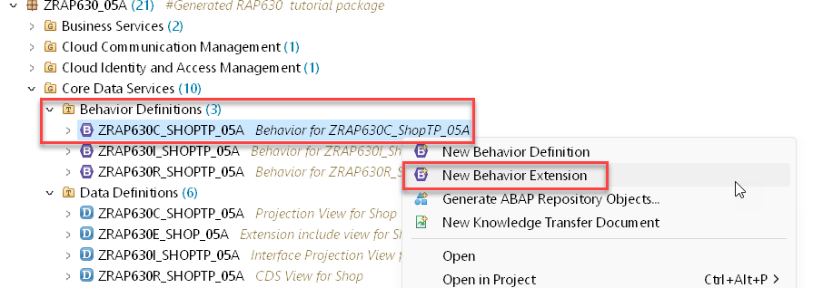
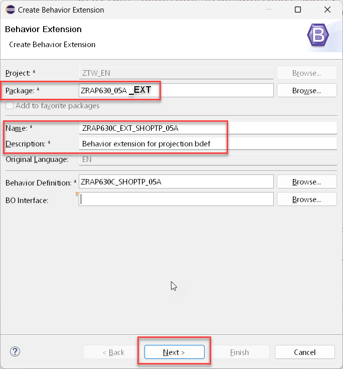
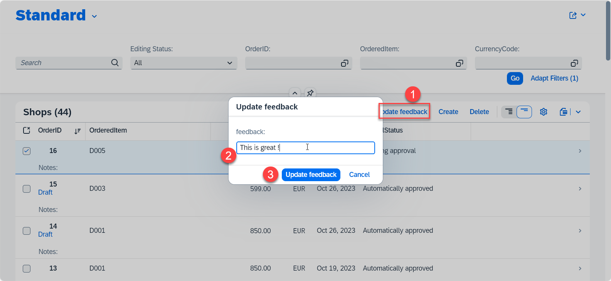

[Home - Cloud ERP Extensibility](../../../../#exercises)

# Exercise 4 - Extend the business object with an action 

After having added a field we will add an action to the base RAP BO. 

> ⚠ Please note:  
> Actions can only be added using extensibility to fields that have been added via extensibility themselves.
> This is why we have added this exercise as the fourth exercise after a field for adding feedback has been added to our Shop RAP business object.   

This action will be used to create/ update comments. 
We will thus make the new field that has been added to enter a comment read-only 
and add the required extensions to the 

- BDEF (add the action)
- Projection BDEF (add a use statement)
- Projection view (add UI annotations to make the button of the action visible)

### Exercise 4.1 Create an abstract entity

We want to provide the feedback for an order as a parameter of an action that will be added as an extenstion.
Parameters are passed to the action using abstract entites.

1. Right click on the folder **Data Definition** in your package `ZRAP630_###_EXT` 
2. Choose **New data defintion** from the context menu  
   - Package: `ZRAP630_###_EXT`  
   - Name: `ZRAP630_A_Feedback_###`   
   - Description: `Pass feedback as a parameter`  
   and press **Next**
5. Select a transport   
5. Select the template **Define abstract entity with parameters** and press **Finish**  
6. Enter the following coding

   <pre lang="ABAP">
   @EndUserText.label: 'Pass feedback as a parameter'
   define abstract entity ZRAP630_A_Feedback_###  
   {
       feedback : abap.char(100);  
   }
   </pre>    

7. Activate your changes   

### Exercise 4.2 Extend the behavior definition 

Now we can define the action with the parameter that has just been created.  

1. Open the behavior extension `ZRAP630R_EXT_SHOPTP_###` 
2. Add the following code snippet in your behavior extension `ZRAP630R_EXT_SHOPTP_###`  

   <pre lang="ABAP">
   field(readonly) zz_feedback_zaa;
   action(authorization : global, features : instance ) ZZ_ProvideFeedback  parameter ZRAP630_A_Feedback_### result[1] $self;
   </pre> 
  
   so that your code now reads
  
   <pre lang="ABAP">  
   extension using interface zrap630i_shoptp_###
   implementation in class zbp_rap630r_ext_shoptp_### unique;
   
   extend behavior for Shop
   {
   
     validation zz_validateDeliverydate on save { create; field DeliveryDate; }
   
     extend draft determine action Prepare
     {
       validation zz_validateDeliveryDate;
     }
     determination ZZ_setOverallStatus on modify { field OrderedItem; }
   
     side effects { field OrderedItem affects field OrderItemPrice , field CurrencyCode ; }
   
     field(readonly) zz_feedback_zaa;
     action(authorization : global, features : instance ) ZZ_ProvideFeedback  parameter ZRAP630_A_Feedback_### result[1] $self;
    }
   </pre>

3. Activate your changes.     

3. Use the code assist (Press Ctrl+1) on the **Shop** entity and let the framework generate the missing artefacts.

   

### Exercise 4.3 - Implement the method for the action in the behvior implementation class

1. Open the local class of the behavior implementation class.

   

2. Implement the method zz_providefeedback and activate your changes

   <pre lang="ABAP">
   METHOD ZZ_ProvideFeedback.
       MODIFY ENTITIES OF ZRAP630I_ShopTP_### IN LOCAL MODE
     ENTITY Shop
   
     UPDATE FIELDS ( zz_feedback_zaa )
     WITH VALUE #( FOR key IN keys ( %tky              = key-%tky
                                      zz_feedback_zaa  = key-%param-feedback  ) ).
   
       "Read the changed data for action result
       READ ENTITIES OF ZRAP630I_ShopTP_### IN LOCAL MODE
         ENTITY Shop
           ALL FIELDS WITH
           CORRESPONDING #( keys )
         RESULT DATA(result_read).
       "return result entities
       result = VALUE #( FOR order_2 IN result_read ( %tky   = order_2-%tky
                                                      %param = order_2 ) ).
   
     ENDMETHOD.
   </pre>

### Exercise 4.4 - Extend the projection BDEF

In order to make the action visible an appropriate `use action` statement has to added to the projection level of the BDEF of the extensible root BO.

1. Right click on the projection behavior definition `ZRAP630_C_ShopTP_###` within the package `ZRAP630_###` and select **New Behavior Extension**  
   
      

2. Fill in the data for the projection behavior extension

   - Package: `ZRAP630_###_EXT` 
   - Name: `ZRAP630C_Ext_SHOPTP_###`
   - Description: Behavior extension for projection bdef   

     

3. Select a transport and press **Finish**  

4. Enter a use statement for your action so that the code looks like 

   <pre lang="ABAP">
   extension for projection;
   
   extend behavior for Shop
   {
   use action ZZ_ProvideFeedback;
   }
   </pre>

### Exercise 4.5 - Add UI annotation

UI annotations have to be added to make the action button visible. This is done in the C-View Extension `ZRAP630C_EXT_SHOPTP_###`.   

For this you have to add the following code snippet to the UI annotatoins.

<pre>, { type: #FOR_ACTION, dataAction: 'ZZ_ProvideFeedback', label: 'Update feedback' } </pre>

so that the code of `ZRAP630C_EXT_SHOPTP_###` now reads

   <pre lang="ABAP">
   extend view entity ZRAP630C_ShopTP_05C with
   {
     @UI.lineItem: [ {
      position: 140 ,
      importance: #MEDIUM,
      label: 'Feedback'
     }
     , { type: #FOR_ACTION, dataAction: 'ZZ_ProvideFeedback', label: 'Update feedback' } 
     ]
     @UI.identification: [ {
     position: 140 ,
     label: 'Feedback'
    } ]
     Shop.zz_feedback_zaa as zz_feedback_zaa
   }
   </pre>

You should now see an action button that allows you to enter feedback.

## Summary

You've now finished.

[^Top of page](#)   
[Home - RAP630](../../../../#exercises)   

